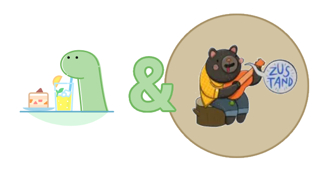

# @fresh-stack/zustand

    

Library with extra features for the Fresh full-stack framework, to implement Zustand in a more native and intuitive way for the hassle-free implementation of CSR islands.